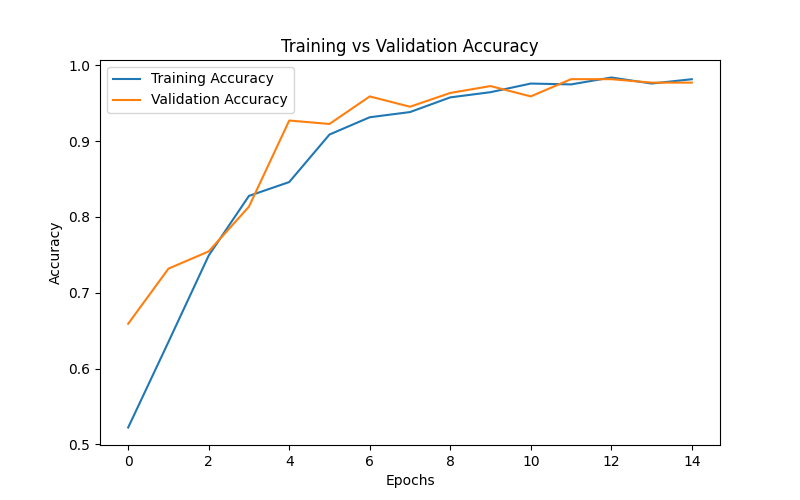
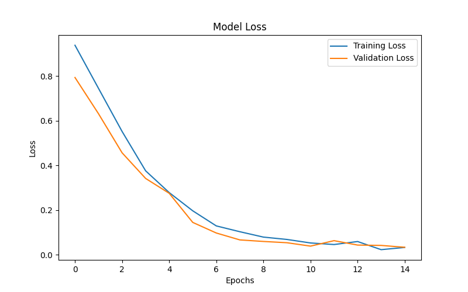
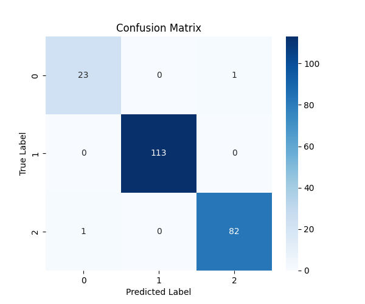
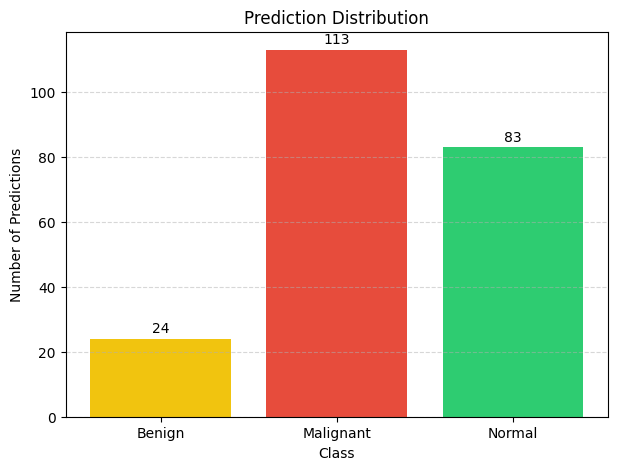
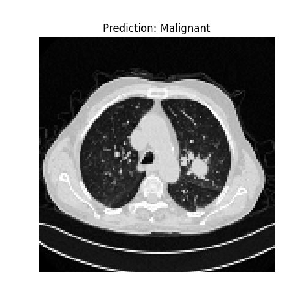
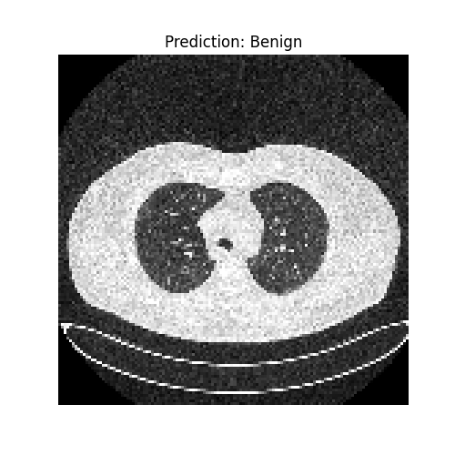
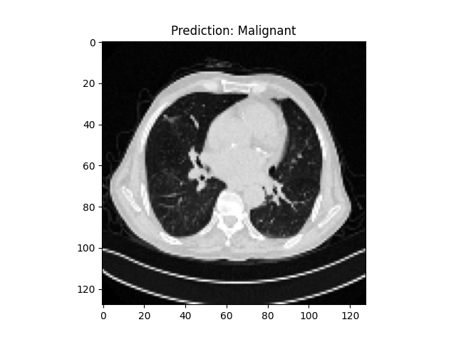

# Lung Cancer Detection Using Deep Learning

## Project Overview

This project explores lung CT scan image classification using Convolutional Neural Networks (CNNs). It is designed as a proof-of-concept deep learning workflow for medical image classification, covering image preprocessing, CNN model development, training, evaluation, prediction visualization, and portfolio presentation.

## Recruiter Snapshot

- Built an end-to-end computer vision pipeline for CT scan image classification.
- Processed **1,097 CT scan images** across `Benign`, `Malignant`, and `Normal` classes.
- Trained binary and multi-class CNN workflows using TensorFlow / Keras.
- Achieved **99.09% test accuracy** on a 220-image held-out project split.
- Reported **0.98 macro average F1-score** for the advanced multi-class model.
- Presented model behavior with accuracy/loss curves, confusion matrix, prediction distribution, and sample predictions.
- Framed the project responsibly as an educational proof of concept, not a clinical diagnosis tool.

Two model workflows were developed:

- **Binary Classification Model:** classifies CT scans as `Cancer` or `Normal`
- **Multi-Class Classification Model:** classifies CT scans as `Benign`, `Malignant`, or `Normal`

Live portfolio page:
[https://bindhusaahithi.github.io/Lung-cancer-detection/](https://bindhusaahithi.github.io/Lung-cancer-detection/)

Repository:
[https://github.com/bindhusaahithi/Lung-cancer-detection](https://github.com/bindhusaahithi/Lung-cancer-detection)

---

## Dataset

The project uses the **IQ-OTHNCCD Lung Cancer Dataset**, which contains class-labeled lung CT scan images.

Dataset source links:

- Official Mendeley Data page: [IQ-OTH/NCCD Lung Cancer Dataset](https://data.mendeley.com/datasets/bhmdr45bh2/4)
- Kaggle dataset: [IQ-OTHNCCD Lung Cancer Dataset](https://www.kaggle.com/datasets/adityamahimkar/iqothnccd-lung-cancer-dataset)

Classes:

- **Normal:** CT scans without lung cancer
- **Benign:** non-cancerous lung abnormalities
- **Malignant:** cancerous lung tumors

All images are converted to grayscale, resized to `128 x 128` pixels, normalized, and prepared for CNN training.

---

## Tools And Technologies

- Python
- TensorFlow / Keras
- OpenCV
- NumPy
- Matplotlib
- Seaborn
- Scikit-learn
- Jupyter Notebook
- HTML / CSS

---

## Skills Demonstrated

- Computer vision preprocessing
- CNN model building
- Binary and multi-class classification
- Train/test splitting and experiment evaluation
- Classification reports, confusion matrix, and prediction analysis
- Model artifact saving with Keras
- Technical documentation and portfolio presentation
- Responsible AI communication for a healthcare-related use case

---

## Role And Deliverables

My role in this project covered the full workflow:

- Prepared class-based CT image datasets for model training
- Built binary and multi-class CNN models
- Evaluated model behavior using accuracy, loss, classification report, confusion matrix, and prediction examples
- Saved trained Keras model artifacts
- Created a live HTML/CSS portfolio page for recruiter-facing presentation
- Documented the project with a clear README and responsible AI limitations

Key deliverables:

- Jupyter notebooks
- Trained model files
- Evaluation plots
- Prediction visualizations
- Live portfolio website
- Recruiter-friendly README documentation

---

## Project Workflow

1. Organize CT scan images into class-based folders
2. Load images and handle unreadable files safely
3. Convert images to grayscale
4. Resize images to `128 x 128`
5. Normalize pixel values
6. Split data into training and testing sets
7. Build CNN architectures for binary and multi-class classification
8. Train and evaluate the models
9. Visualize accuracy, loss, confusion matrix, prediction distribution, and examples
10. Save trained Keras models
11. Present the project as a portfolio case study

---

## Model Architecture

The CNN architecture includes:

- Convolution layers
- MaxPooling layers
- Flatten layer
- Dense layers
- Dropout layer
- Output layer

The binary model uses a sigmoid output. The multi-class model uses a softmax output.

---

## Results

The advanced CNN model demonstrates a proof-of-concept workflow for classifying lung CT scan images using the current dataset split.

Performance summary:

- **Test accuracy:** 99.09%
- **Macro average F1-score:** 0.98
- **Evaluation split:** 220 held-out CT images

These numbers are dataset-specific portfolio results and should not be interpreted as clinical validation.

### Training Accuracy



This chart shows how training and validation accuracy changed during model training.

### Training Loss



This chart shows how training and validation loss changed across epochs.

### Confusion Matrix



The confusion matrix summarizes prediction behavior across the `Benign`, `Malignant`, and `Normal` classes.

### Prediction Distribution



This chart shows how predictions were distributed across the target classes.

### Prediction Examples

Normal prediction example:



Benign prediction example:



Malignant prediction example:



---

## Limitations

This project is intended as a portfolio and educational proof of concept.

The current results are based on a dataset-specific train-test split and do not include external validation, patient-level splitting, clinical testing, or deployment safeguards.

The model should not be used for medical decision-making, clinical diagnosis, or treatment planning.

---

## Future Improvements

- Validate the model on an external CT scan dataset from a separate source
- Use patient-level splitting to reduce data leakage risk
- Add explainability methods such as Grad-CAM to highlight image regions influencing predictions
- Compare the CNN against transfer learning architectures
- Add deployment safeguards and human-review boundaries before any real-world medical use

---

## Project Structure

```text
Lung-Cancer-Detection/
├── images/
│   ├── training_accuracy.png
│   ├── training_loss.png
│   ├── confusion_matrix.png
│   ├── prediction_distribution.png
│   ├── prediction_normal.png
│   ├── prediction_benign.png
│   └── prediction_malignant.png
├── Notebook/
│   ├── basic_cnn_lung_cancer_detection.ipynb
│   └── advanced_lung_cancer_detection.ipynb
├── models/
│   ├── lung_cancer_cnn_model.keras
│   └── advanced_lung_cancer_model.keras
├── index.html
├── style.css
├── requirements.txt
└── README.md
```

---

## How To Run

Install dependencies:

```bash
pip install -r requirements.txt
```

Open the notebooks in Jupyter:

```bash
jupyter notebook
```

Open the portfolio page locally:

```bash
open index.html
```
